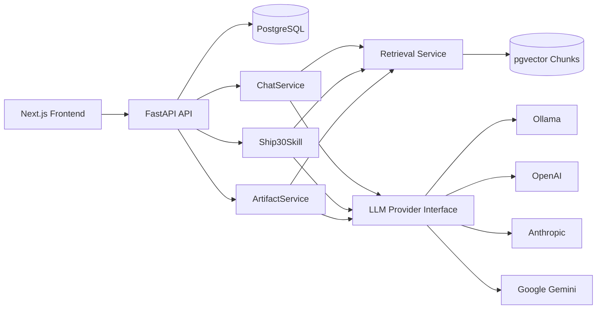
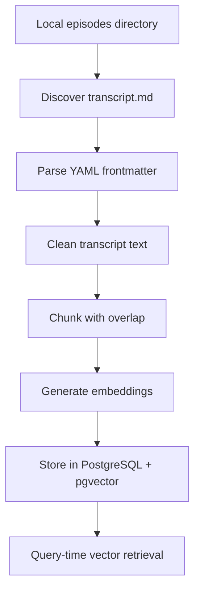

# Architecture

## Overview

The system separates application concerns into frontend UI, API/session
persistence, retrieval, agent routing, LLM providers, and artifact rendering.

## Frontend

The frontend is a Next.js TypeScript app with an app-first layout:

- Session sidebar.
- Main chat panel.
- Artifact viewer.
- Provider/model status surface.
- Source citation components.

## Backend

The backend is a FastAPI app organized around:

- `api`: route handlers and API contracts.
- `core`: settings, logging, request infrastructure.
- `db`: database sessions and health checks.
- `models`: SQLAlchemy models.
- `schemas`: Pydantic request/response models.
- `services`: application orchestration.
- `retrieval`: vector search.
- `providers`: LLM and embedding providers.
- `skills`: Ship 30 and artifact generation.
- `agents`: reserved package, currently unused — see Agent Routing below
  for why routing lives in `api`/`services` instead.

## Agent Routing

There is no single "agent" that classifies free-form user intent and
dispatches to a tool. Instead, each capability is its own explicit API
route backed by its own service, and the **frontend chooses which route
to call**:

- `POST /api/chat` → `ChatService` — grounded Q&A with retrieval,
  history, and deterministic refusal when nothing relevant is retrieved.
- `POST /api/skills/ship30` → `Ship30Skill` — two-pass grounded essay
  generation.
- `POST /api/artifacts/generate` → `ArtifactService` — Markdown/HTML
  artifact generation.

This is a deliberate simplification, not an oversight. The assignment
names the Anthropic Claude Agent SDK as the expected way to build the
agent layer; we evaluated it and found two blockers documented in
`PRD.md` under "Agent Layer Decision": it shells out to the `claude` CLI
(a Node.js/npm dependency, not bundled with the pip package) and it can
only call Anthropic's own models, which conflicts with this project's
mandatory local-Ollama demo path. Rather than force-fit a tool-use agent
loop around a single provider, each skill is reached directly and stays
provider-agnostic — identical behavior regardless of whether Ollama,
OpenAI, Anthropic, or Gemini is the active provider.

## Database

Milestone 2 added SQLAlchemy models and Alembic migrations for users, chat
sessions, messages, and artifacts. Milestone 3 will add transcript documents and
chunks with pgvector embeddings and source metadata.

## Initial API Surface

- `GET /health`: process health.
- `GET /health/ready`: dependency readiness, beginning with database status.
- `POST /api/sessions`: create a chat session.
- `GET /api/sessions`: list chat sessions.
- `GET /api/sessions/{session_id}`: fetch a session with message history.
- `PATCH /api/sessions/{session_id}`: update a session title.
- `POST /api/sessions/{session_id}/messages`: append a message.
- `GET /api/sessions/{session_id}/messages`: list session messages.

Later milestones will add chat generation, providers, artifacts, ingestion, and
retrieval endpoints.

## Knowledge Pipeline

Normal chat calls query pgvector for relevant chunks. The backend does not load
all transcript files into the LLM context for each request.

## Provider Abstraction

The planned `LLMProvider` interface will support:

- `generate`: grounded answer/content generation.
- `health`: provider availability and model status.
- Configuration from environment variables.

Initial implementations will be Ollama and OpenAI.

## Artifact Security

Markdown artifacts will render as formatted Markdown. HTML/CSS artifacts are
untrusted and will render in a sandboxed iframe with scripts blocked. The viewer
will avoid direct arbitrary `dangerouslySetInnerHTML` rendering.

## Deployment

Docker Compose will run PostgreSQL with pgvector, the backend, and the frontend.
Ollama is documented as a local host dependency so users can manage model pulls
outside the app container.
