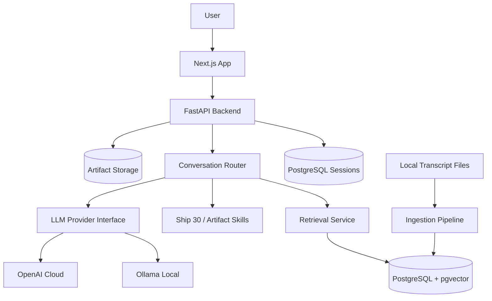

# Implementation Plan

## Milestone 0 Summary

Repository discovery found a nearly empty project containing only a starter
`README.md`, an existing `.gitignore`, and the initial Git commit. No backend,
frontend, Docker, transcript source, database schema, or tests exist yet.

Milestone 0 is intentionally planning-only. Application code starts in
Milestone 1 after approval.

## Product Goal

Build The Lenny Growth Assistant: a polished internal AI assistant that answers
product and growth questions using grounded retrieval from local Lenny's Podcast
transcripts, preserves chat sessions, supports generated writing/artifacts, and
can switch between Ollama and a cloud LLM provider without code changes.

## Architecture Proposal

## Tech Stack Decisions

- **Backend:** FastAPI with Pydantic settings and schemas, SQLAlchemy ORM, and
  Alembic migrations. This is the most direct fit for the assignment and keeps
  API contracts explicit.
- **Database:** PostgreSQL with `pgvector`. This satisfies persistence and
  vector search in one operational dependency.
- **Frontend:** Next.js with TypeScript and Tailwind CSS. The UI will be an
  app-first workspace with sidebar, chat panel, and artifact viewer.
- **Local LLM:** Ollama using `llama3.1:8b` as the documented default candidate
  because it is widely available and practical for local demos. The model name
  remains configurable.
- **Cloud LLM:** OpenAI as the initial cloud provider because it has dependable
  text and embedding APIs and simple environment-driven configuration.
- **Embeddings:** OpenAI embeddings for cloud mode and Ollama embeddings for
  local mode where possible. The embedding provider will be abstracted so the
  ingestion path does not depend on one vendor.
- **Agent SDK Requirement:** Use an explicit agent/service boundary inspired by
  the required architecture. Milestone 4 will verify whether the Anthropic Claude
  Agent SDK can be integrated cleanly. If it introduces fragility for this
  FastAPI product, the decision and fallback will be documented.
- **Artifacts:** Markdown rendered as formatted content; generated HTML/CSS
  rendered in a sandboxed iframe with scripts blocked.

## Knowledge Ingestion Strategy

The ingestion pipeline will:

1. Read `TRANSCRIPTS_DIR`, defaulting to
   `./knowledge-source/lennys-podcast-transcripts/episodes`.
2. Recursively discover `**/transcript.md`.
3. Parse YAML frontmatter for metadata.
4. Clean and normalize transcript text.
5. Chunk transcripts with overlap.
6. Generate embeddings.
7. Store chunks, embeddings, source paths, content hashes, and metadata in
   PostgreSQL.
8. Skip unchanged transcripts during refresh using file/content hashes.

The local transcript repository should not be committed wholesale until its size
is inspected. The default plan is to ignore it from this repository and document
a setup script or clone step for evaluators.

## Milestone Plan

1. **Foundation and Documentation:** Create repository structure, env example,
   Docker foundations, FastAPI health endpoint, frontend shell, PRD, design doc,
   architecture doc, and baseline verification.
2. **Database, Sessions, and Persistence:** Add PostgreSQL models, migrations,
   session/message APIs, and persistence tests.
3. **Transcript Ingestion and Knowledge Base:** Add validation, ingestion,
   refresh, embeddings, pgvector storage, retrieval, and metadata tests.
4. **LLM Provider Abstraction and Ollama:** Add provider interface, Ollama,
   OpenAI, provider selection, model status, and graceful failures.
5. **Grounded RAG Conversational Assistant:** Add chat endpoint, retrieval,
   grounded answering, citations, follow-up context, and empty-retrieval
   behavior.
6. **Ship 30 for 30 Skill:** Add reusable writing skill with grounded outline,
   formatted essay generation, approximate word-count checks, and citations.
7. **Artifact Generation and Security:** Add Markdown/HTML artifact generation,
   persistence, viewer contract, sanitization, and sandboxing.
8. **Polished Frontend Experience:** Build chat UI, session sidebar, source
   display, provider indicator, artifact viewer, responsive states, and
   accessibility improvements.
9. **Observability, Resilience, and Testing:** Add structured logs, request IDs,
   timeouts, broader tests, and manual test plan.
10. **Deployment and Final Handoff:** Finalize Docker Compose, docs, fresh-run
    verification, troubleshooting, and evaluator handoff.
11. **Demo Preparation:** Add a concise demo flow, script, trade-off summary,
    and evaluator checklist.

Each milestone will be verified, committed, reported, and stopped before
continuing.

## Assumptions

- The evaluator can install Docker, Node.js, Python tooling, and Ollama.
- The transcript repository can be cloned into `knowledge-source/` before
  ingestion and does not need to be bundled into the main app repository.
- Cloud provider credentials may be absent during local evaluation, so cloud
  failures must be explicit and non-fatal.
- A local Ollama model may be missing, so provider status checks must distinguish
  connection failure from missing model.
- Automated tests can use representative fixture transcripts rather than the
  complete transcript repository.

## Risks and Mitigations

- **Transcript repository size:** Inspect before committing. Prefer documented
  local clone or submodule rather than vendoring large raw data.
- **pgvector setup friction:** Include Docker Compose with pgvector-enabled
  PostgreSQL.
- **Local model quality and latency:** Keep model configurable and document a
  practical default.
- **Hallucinations:** Use strict grounded prompts, empty-retrieval responses, and
  source-only citation display.
- **Embedding provider differences:** Hide provider-specific behavior behind an
  embedding interface.
- **Generated HTML security:** Render in restrictive sandboxed iframes and block
  scripts.
- **Agent SDK uncertainty:** Investigate during provider/agent milestone and
  document any pragmatic deviation.
- **Evaluator setup burden:** Keep one-command Docker path where possible and
  provide clear troubleshooting.

## Implementation Checklist

- [x] Inspect repository state.
- [x] Read assignment requirements.
- [x] Select initial architecture and stack.
- [x] Define ingestion and retrieval strategy.
- [x] Define milestone sequence.
- [x] Document assumptions and risks.
- [x] Build Milestone 1 foundation after approval.
- [x] Build Milestone 2 persistence after approval.
